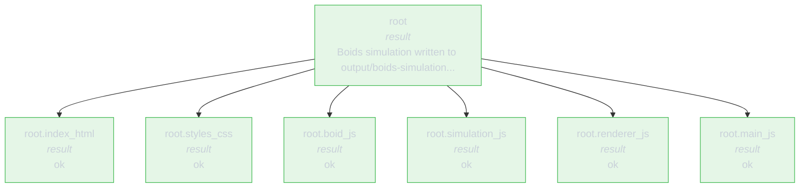

# rlmflow

<p align="center">
  <a href="https://pypi.org/project/rlmflow/"></a>
  <a href="https://github.com/shyamsn97/rlmflow/pkgs/container/rlmflow"></a>
</p>

A Python library for createing interactible, steppable graph [Recursive Language Models](https://arxiv.org/abs/2512.24601).

Recursive Language Models are powerful systems -- capable of handling long-context tasks by spawning sub-agents with their own fresh context windows. However. RLMs get messy fast: parents spawn children, children spawn more children, which also can run for multiple steps, etc.

**rlmflow** turns the run into an explicit graph. Every query, action,
observation, child call, wait, resume, and result is a typed, immutable
state you can step, inspect, fork, and replay. Each `start` / `step`
returns a fresh `Graph` snapshot — a recursive structure where every
`graph[id]` (node *or* agent id) returns a `Graph` rooted at that
vertex.

<p align="center">
  
</p>

## RLMs as Graphs

RLMs delegate subtasks to children, those children can delegate to their
own children, and results bubble back up. **rlmflow** represents the
whole run as one recursive type:

- **`Graph`** — one agent, frozen. Carries the agent's run-invariants
  flat on itself (`agent_id`, `depth`, `query`, `system_prompt`,
  `config`, `workspace`, `runtime`, `model`, `branch_id`,
  `parent_agent_id`, `parent_node_id`), plus its `states` trajectory
  and a `children: dict[str, Graph]` of sub-agents. Cross-agent
  navigation is `graph[other_aid]`; subtree views are `graph.agents`,
  `graph.nodes`, `graph.edges`.
- **`Node`** — one immutable state in an agent's trajectory. The
  trajectory is a strict alternation of **observations** (inputs the
  system received) and **actions** (work the system did). Nine leaf
  types under four base classes — see
  [`docs/internal/node_model.md`](docs/internal/node_model.md):
  - Observations: `UserQuery`, `LLMOutput`, `ExecOutput`,
    `SupervisingOutput`, `ErrorOutput`, `DoneOutput`.
  - Actions: `LLMAction`, `ExecAction`, `ResumeAction`.

For example, an agent that delegates two children and combines their
results writes one REPL block like this:

```python
h1 = rlm_delegate("search", "Find evidence", context=chunk_a)
h2 = rlm_delegate("verify", "Check the answer", context=chunk_b)
results = yield rlm_wait(h1, h2)
done(combine(results))
```

`yield rlm_wait(...)` is a real Python generator suspension point. Each
REPL block is wrapped in a synthetic generator and driven by the
engine via `send()`:

```python
def __rlm_gen__():
    h1 = rlm_delegate("search", "...", context=chunk_a)
    h2 = rlm_delegate("verify", "...", context=chunk_b)
    results = yield rlm_wait(h1, h2)   # ← suspend here
    done(combine(results))
```

The engine's loop, roughly:

```python
out = gen.send(None)               # run until the yield
# out is a WaitRequest([h1, h2]) → suspend the parent, run children
results = [c.result() for c in children]
gen.send(results)                  # resume; `results` is now the list
```

The REPL is stateful across blocks, so the next LLM turn can still
see `h1`, `h2`, `results`. Only `yield rlm_wait(...)` is special — any
other top-level yield is pumped through and ignored:

```python
yield rlm_wait(h)    # suspend, then resume with children's results
yield 42             # discarded, immediately resumed
yield handle         # discarded (forgot to wrap in rlm_wait()? no result)
```

See [`docs/internals.md`](docs/internals.md) for the full protocol.

The block above becomes this execution graph (one obs/action pair
per step):

```text
UserQuery(root)
  -> LLMAction -> LLMOutput(code="rlm_delegate(search) + rlm_delegate(verify); rlm_wait(...)")
  -> ExecAction -> SupervisingOutput(waiting_on=[root.search, root.verify])
      -> UserQuery(root.search)  -> ... -> DoneOutput(root.search)
      -> UserQuery(root.verify)  -> ... -> DoneOutput(root.verify)
  -> ResumeAction -> ExecOutput(resumed_from=[root.search, root.verify])
  -> LLMAction -> LLMOutput(code="done(combine(...))")
  -> ExecAction -> DoneOutput(root)
```

## Install

```
pip install rlmflow               # core
pip install rlmflow[openai]       # + OpenAI client
pip install rlmflow[anthropic]    # + Anthropic client
pip install rlmflow[viewer]       # + Gradio viewer (plotly)
pip install rlmflow[image]        # + static image / GIF export (kaleido)
pip install rlmflow[all]          # all of the above
```

From source:

```
git clone https://github.com/shyamsn97/rlmflow && cd rlmflow
pip install -e .
```

## Quick start

This example is all you need for a simple and interpretable recursive coding agent. see [notebook](./examples/notebooks/coding_agent.ipynb)

```python
from rlmflow import OpenAIClient, RLMConfig, RLMFlow, Workspace
from rlmflow.prompts.default import DEFAULT_BUILDER
from rlmflow.runtime.local import LocalRuntime
from rlmflow.tools import FILE_TOOLS
from rlmflow.utils.viewer import open_viewer

# A small prompt extension layering coding strategy guardrails on top of
# the default protocol prompt. See examples/coding-agent/prompt.py.
CODING_BUILDER = DEFAULT_BUILDER.section(
    "coding",
    """
- **Plan ownership before writing.** For non-trivial coding tasks, first make a compact manifest: file/component owners, shared interfaces, dependencies, and acceptance checks. The parent plans boundaries; children own implementation details.
- **Keep plans lightweight.** Give children enough direction to own their piece without pre-writing the whole file for them.
- **Bias toward delegation for separable work.** Do small, local tasks directly; when files, components, chunks, or checks can be owned independently, delegate them before implementing inline.
- **Honor the requested artifact.** If the user asks for a component, app, CLI, test, script, library, config, migration, or data file, produce that artifact's expected files and behavior. Do not substitute a generic page, placeholder, README, template, or unrelated scaffold; preserve the requested runtime/API/contract in verification.
- **Delegate focused artifact work.** Give each child one bounded file/component/chunk/check with a clear expected output. File-writing children must call `write_file(...)`, verify that file from disk, and return a short status.
- **Pass only needed context.** Give children a spec, a relevant `CONTEXT.lines(...)` slice, or `""`; don't dump your whole view unless necessary.
- **Combine from disk.** After children finish, read the files they wrote and verify the shared contract.
- **Run real checks.** Syntax-check, run tests, or smoke-test the entry point before `done()` when the runtime can.
- **Repair surgically.** After an exception, `ls`/`read_file` first; fix the broken file instead of rewriting or re-delegating everything.
""".strip(),
    title="Coding",
    after="builtins",
)

workspace = Workspace.create("./myproject")
runtime = LocalRuntime(workspace=workspace)

# Sandbox agent code inside Docker instead: drop-in replacement,
# same interface.  Build the image once with `docker build -t rlmflow:local .`
# from the repo root; see docs/runtimes.md and docs/security.md.
#
# from rlmflow.runtime.docker import DockerRuntime
# runtime = DockerRuntime("rlmflow:local", workspace=workspace)

runtime.register_tools(FILE_TOOLS)

agent = RLMFlow(
    llm_client=OpenAIClient("gpt-5"),
    runtime=runtime,
    workspace=workspace,
    config=RLMConfig(max_depth=2, max_iterations=30),
    llm_clients={ # additional llm clients to be chosen to delegate
        "fast": {
            "model": OpenAIClient("gpt-5-mini"),
            "description": "Cheap model for smaller subtasks",
        },
    },
    prompt_builder=CODING_BUILDER,
)

query = "Build a python text-based adventure game with combat and inventory."
graph = agent.start(query)
while not graph.finished:
    graph = agent.step(graph)
    print(graph.tree())

print(graph.result())
open_viewer(workspace)
```

`Workspace.create("./myproject")` writes a debuggable workspace as it runs:
`session/<agent-id>/` holds the per-agent state log (`session.jsonl`,
`agent.json`, `latest.json`), `graph.json` is the compact graph manifest
for the whole run, and `context/<agent-id>/` holds payloads exposed as
`CONTEXT`. The workspace is the saved run: reopen it later with
`Workspace.open_path("./myproject").load_graph()` or `open_viewer("./myproject")`.

## Drop-in `LLMClient`

`RLMFlow` implements `LLMClient`, so it is a drop-in replacement for any LLM.

```python
def ask(llm: LLMClient, q: str) -> str:
    return llm.chat([{"role": "user", "content": q}])

ask(OpenAIClient("gpt-4o-mini"), "2+2?")             # one LLM call
ask(RLMFlow(llm_client=..., runtime=...), "2+2?")    # full agent, same return type
```

Nest agents by passing one `RLMFlow` as another's `llm_client`.

## Step and inspect

`step(graph) -> graph'` is one atomic graph transition. Every step
returns a new immutable `Graph`, so the live tree is just `graph.tree()`:

```python
graph = agent.start(query)
while not graph.finished:
    graph = agent.step(graph)
print(graph.tree())
```

```text
root [supervising] {default}
├── root.scanner_auth [result] {fast} -> Found SQL injection in login.py
├── root.scanner_api  [supervising] {default}
│   ├── root.scanner_api.chunk_0 [result] {fast} -> Clean
│   └── root.scanner_api.chunk_1 [result] {fast} -> Payment flow is safe
└── root.scanner_db   [result] {fast} -> No issues found
```

Every transition follows the same obs → action → obs shape:

```text
LLMOutput  -> ExecAction -> ExecOutput          (REPL output, normal continuation)
                         -> DoneOutput          (code called done())
                         -> ErrorOutput         (code raised / no code block)
                         -> SupervisingOutput   (code yielded — waiting on children)
SupervisingOutput -> ResumeAction -> ExecOutput / Done / Error / Supervising
                                                (children settled — supervisor unpaused)
ExecOutput -> LLMAction -> LLMOutput            (back to the LLM for the next turn)
```

Action nodes carry the work the engine did; observation nodes carry
what was returned. Every action is followed by exactly one
observation. The graph is queryable in plain Python:

```python
graph.tree()                                  # ASCII render
graph["root.scanner_api"]                     # sub-Graph rooted at that agent / node
graph.agents["root.scanner_api"].states       # state trajectory for one agent
graph.children                                # list[Graph] for child agents
graph.nodes.find("n_abc...")                  # bare Node lookup by id
graph.nodes.errors()                          # every ErrorOutput across agents
graph.nodes.results()                         # every DoneOutput across agents
graph.nodes.supervising()                     # every SupervisingOutput across agents
graph.nodes.where(type="llm_output", agent_id="root")  # kwargs match Node attrs
graph.nodes.where(lambda n: n.type == "exec_output")    # or pass a predicate
graph.to_dict()                               # full JSON-serializable payload
```

## Workspace, Branch, Replay

When you run with a `Workspace`, the workspace directory is the durable run:

```python
workspace = Workspace.open_path("./myproject")
graph = workspace.load_graph()
agent = RLMFlow(llm_client=AnotherModel(), workspace=workspace, ...)
while not graph.finished:
    graph = agent.step(graph)
```

To branch into an isolated workspace with its own session, context, and
working tree:

```python
alt = workspace.fork(new_branch_id="repair", new_dir="./runs/repair")
alt_agent = RLMFlow(llm_client=..., workspace=alt, ...)
```

See [`examples/showcase.py`](examples/showcase.py) for workspace persistence,
session reads, time travel through `list[Graph]`, and gym-style stepping in one
file.

## Rich visualization

See [notebook](./examples/notebooks/viz_walkthrough.ipynb) for a full showcase of vizualization utilities.

Because the run is a typed graph, every visualization is just a render of
that graph. Normal runs are viewed from their workspace.


### Gradio viewer


`open_viewer(workspace)` launches a small browser app for inspecting a
saved workspace — tree, summary, and raw state JSON side by side:

```python
from rlmflow.utils.viewer import open_viewer

open_viewer("./myproject")
```

From the CLI: `rlmflow view ./myproject --port 7861`.

### Live terminal tree

`rlmflow.utils.viz.live(agent, graph)` drives the step loop and renders a
Rich tree as states are produced. The boids run (`Create a simple boids
simulation in plain HTML and JavaScript, split each component into
separate files`) settles to:

```text
root [result] {default:gpt-5} -> Boids simulation written to output/boids-simulation with modular JS (boid, simulation, renderer) and index.html entrypoint.
  root.index_html    [result] {fast:gpt-5-mini} -> ok
  root.styles_css    [result] {fast:gpt-5-mini} -> ok
  root.boid_js       [result] {fast:gpt-5-mini} -> ok
  root.simulation_js [result] {fast:gpt-5-mini} -> ok
  root.renderer_js   [result] {fast:gpt-5-mini} -> ok
  root.main_js       [result] {fast:gpt-5-mini} -> ok
```

The same render is available offline as `graph.tree()` on any snapshot.
Filename-flavored agent ids (`index.html` → `index_html`) are sanitized
because `.` is the parent/child delimiter in the agent tree.

### Static renders

`rlmflow render <path> -f F` writes a static visualization in any of:

```text
mermaid             # stateDiagram-v2 (default topology)
mermaid-flowchart   # flowchart TD, better for wide trees
mermaid-sequence    # sequenceDiagram of delegate / wait / resume
dot · d2            # Graphviz / D2 topology
tree · ascii-boxes  # text trees
gantt-html          # standalone HTML swimlane
report-md           # full Markdown summary (tree + cost + result + errors)
code-log            # every code block paired with its observation
error-summary       # ErrorOutput counts grouped by kind
tokens              # one-line ASCII sparkline of cumulative tokens
html                # self-contained interactive stepper, one slide per snapshot
image               # single PNG/SVG/PDF of the topology snapshot
steps               # one image per snapshot, written as step_NN.{png,svg,pdf}
```

```bash
rlmflow render ./myproject -f mermaid-flowchart
rlmflow render ./myproject -f gantt-html -o run.html
rlmflow render ./myproject -f report-md  -o run.md
rlmflow render ./myproject -f tokens
```

GitHub renders mermaid inline, so the output drops straight into a doc.
The example below is the `to_mermaid_flowchart(graph)` projection of the
boids run; it renders reliably across the GitHub-supported mermaid
versions:



### Programmatic helpers

Everything the CLI does is one function call away:

```python
from rlmflow.utils.export import to_mermaid, to_mermaid_flowchart, to_mermaid_sequence, to_dot, to_d2
from rlmflow.utils.viz import (
    ascii_boxes, code_log, error_summary, message_stream, diff_system_prompts,
    gantt, gantt_html, token_sparkline, budget_burndown, bench_table,
    report_md, live, tee, slack_webhook, discord_webhook,
)
from rlmflow.utils.tracing import json_logs

print(token_sparkline(graphs))          # ▁▂▅█▂   15820 tok over 7 steps
print(error_summary(graph))             # ErrorOutput counts grouped by kind
print(message_stream("root.boid_js", graph))     # rendered transcript for one agent
print(report_md(graphs, title="run"))   # full Markdown report
gantt_html(graphs, "run.html")          # standalone HTML swimlane
json_logs(graph, "run.jsonl")           # one state per line
```

### Image, GIF, and HTML exports

For blog posts, PR comments, papers, and CI artifacts, render the
graph straight to a PNG/SVG/PDF, an animated GIF, or a single
self-contained HTML stepper. Four public functions live in
`rlmflow.utils`, plus matching CLI verbs:

| Function                                | CLI verb        | Output                                | Use case                                   |
|-----------------------------------------|-----------------|---------------------------------------|--------------------------------------------|
| `save_image(graph, path)`               | `-f image`      | one PNG/SVG/PDF                       | hero image of a finished run               |
| `save_steps(graphs, dir/)`              | `-f steps`      | `step_NN.png` per snapshot            | blog slideshow, paper figure series        |
| `save_gif(graphs, path)`                | _(no verb yet)_ | animated GIF                          | quick preview / social posts               |
| `save_html(graphs, path)`               | `-f html`       | self-contained stepper (Plotly + CSS) | shareable URL-less artifact, PR comment    |

Quick start:

```python
from rlmflow import Workspace
from rlmflow.utils import save_image, save_steps, save_html, save_gif

workspace = "./myproject"
graph = Workspace.open_path(workspace).load_graph()

save_image(workspace, "run_final.png")           # latest workspace snapshot
save_html(workspace, "viewer.html", title="run") # standalone viewer

# If you kept an in-memory history list, playback exports still work:
save_steps(graphs, "frames/")                    # one PNG per step
save_gif(graphs, "trace.gif", duration=400)      # animated GIF (~2.5 fps)
```

Or use the graph shorthand (same defaults):

```python
graph.save_image("run_final.png")
graph.save_html("viewer.html")
```

#### Why the scaling knobs exist

The on-screen Plotly figure is laid out for ~420 px tall, with 11 px
markers and 10 px labels — sized to look right on a Jupyter cell. A
naive 1800 px PNG export keeps those pixel sizes literal, so every
marker shrinks to a speck and every label to a thread.

The save helpers compensate with three knobs:

| Knob               | Default (image/steps/gif) | Default (html) | Effect                                                                                     |
|--------------------|---------------------------|----------------|---------------------------------------------------------------------------------------------|
| `element_mult`     | `3.0`                     | `2.0`          | Uniform multiplier on markers + edges + fonts. The simplest "make it bigger" knob.         |
| `marker_mult`      | _(inherits)_              | _(inherits)_   | Override just the marker size + edge width. Bump higher than `text_mult` on dense trees.    |
| `text_mult`        | _(inherits)_              | _(inherits)_   | Override just the label font size. Smaller text = fewer collisions when nodes are close.    |
| `normalize_labels` | `True`                    | `True`         | Force every label to `bottom center` so adjacent depths can't share a vertical band.        |

The HTML stepper additionally defaults to `height=720` (vs the
~420 px on-screen default) so its native marker sizes land in the
same proportion to the canvas as a `save_image` PNG.

`element_mult` is the lazy default; pass `marker_mult` and/or
`text_mult` to break the symmetry when labels are colliding even at
3× scale.

#### Recipes

**Hero PNG of a finished run** — defaults are tuned for this:

```python
graph.save_image("hero.png")
# == save_image(graph, "hero.png", width=1800, height=1350,
#               scale=2.0, element_mult=3.0, normalize_labels=True)
```

**Blog slideshow with dense subtrees** — fat markers, small labels,
square-ish canvas (the recipe behind `docs/blog.md`):

```python
save_steps(
    graphs,
    "blog/frames/",
    width=1600, height=1200, scale=2.0,
    marker_mult=3.5,        # fat node dots + edges
    text_mult=2.2,          # shrink labels so they don't collide
    normalize_labels=True,  # already the default — explicit for the reader
)
```

**Standalone interactive stepper** — drop into a PR comment or
GitHub gist:

```python
save_html(workspace, "viewer.html", title="needle haystack run")
```

The HTML output embeds Plotly from CDN, includes per-slide
transcripts, and ships keyboard navigation (← / →) plus dot-style
slide indicators. Open it in any browser, attach it to an email,
upload it as a CI artifact — it works offline once the CDN script
is cached.

**Animated GIF** — needs `pip install rlmflow[image] pillow`:

```python
save_gif(
    graphs,
    "trace.gif",
    duration=600,          # ms per frame; lower = faster
    loop=0,                # 0 = forever; 1 = play once
    width=1200, height=900,
    element_mult=2.0,
)
```

#### From the CLI

Every knob above maps 1:1 to a CLI flag:

```bash
# blog slideshow recipe (matches the dense-tree recipe above)
rlmflow render ./myproject \
  -f steps -o blog/frames/ \
  --width 1600 --height 1200 --scale 2.0 \
  --marker-mult 3.5 --text-mult 2.2

# self-contained interactive stepper
rlmflow render ./myproject \
  -f html  -o stepper.html --title "boids walkthrough"

# single hero PNG with default scaling
rlmflow render ./myproject \
  -f image -o hero.png

# opt out of label normalization (matches Gradio viewer defaults)
rlmflow render ./myproject \
  -f html  -o stepper.html --no-normalize-labels
```

The CLI auto-picks `element_mult=2.0` for `-f html` (so the live
stepper's native 14 px markers stay readable) and `element_mult=3.0`
for `-f image` / `-f steps` (where the much larger PNG canvas would
otherwise shrink markers to specks). Node sizes are uniform; token
counts stay in hover/details, not marker size. Override either with
`--element-mult`.

#### Dependencies

- `save_image` / `save_steps` need `kaleido`. Install with
  `pip install rlmflow[image]` or just `pip install kaleido`.
- `save_gif` additionally needs `Pillow`
  (`pip install rlmflow[image] pillow`).
- `save_html` and `render_html` have **no static-image dependency** —
  they emit a single HTML file that embeds Plotly from CDN.

## Examples

All examples share flags like `--no-viz`, `--docker-image rlmflow:local`,
`--max-depth`, and `--max-iterations`. See [`examples/README.md`](examples/README.md).

| Example | What it shows |
|---|---|
| [`showcase.py`](examples/showcase.py) | `Graph` snapshots, workspace persistence, session reads, time travel, gym-style stepping. |
| [`drop_in_llm.py`](examples/drop_in_llm.py) | `RLMFlow` as an `LLMClient`. Nested agents. |
| [`coding-agent/agent.py`](examples/coding-agent/agent.py) | Interactive coding agent that writes and edits files. |
| [`needle_haystack.py`](examples/needle_haystack.py) | Needle-in-a-haystack across 500 files with custom tools and `runtime_factory`. |
| [`summarizer.py`](examples/summarizer.py) | Recursive map-reduce over a long document. |
| [`view_demo.py`](examples/view_demo.py) | Build synthetic `Graph` snapshots and launch the Gradio viewer. |
| [`notebooks/coding_agent.ipynb`](examples/notebooks/coding_agent.ipynb) | Build the agent, run the boids task end-to-end, and inspect the workspace/viewer. Requires a live LLM. |
| [`notebooks/viz_walkthrough.ipynb`](examples/notebooks/viz_walkthrough.ipynb) | Every visualization against the saved fixture: inline tree, Plotly graph, HTML stepper, topology renders (mermaid/dot/d2/sequence), step-indexed timeline, per-state detail, cost & reports, run-vs-run comparison, CLI equivalents. |
| [`notebooks/node_basics.ipynb`](examples/notebooks/node_basics.ipynb) | `Graph` query API tour — `graph[aid]`, `graph.nodes`, `graph.nodes.find`, `graph.nodes.where`, `graph.nodes.results`/`errors`, per-agent tokens, `session.load_graph`, state streaming with `tee` / `json_logs`. |

## Benchmarks

A runnable RLM-vs-flat harness for **OOLONG** (long-context aggregation,
~250k tokens) lives under [`benchmarks/oolong/`](benchmarks/oolong/).
It mirrors Prime Intellect's reference environment but talks directly
to `rlmflow` instead of `verifiers`. Three modes — `standard` (one big
flat call), `rlm` (recursive scaffold), `rlm_tips` (recursive +
chunking hints) — across `synth`, `synth_with_labels`, and `real`
subsets, scored deterministically against the published gold answers.

```bash
python benchmarks/oolong/run.py --mode rlm --subset synth --limit 50
python benchmarks/oolong/aggregate.py --runs runs/oolong-*
```

See [`benchmarks/oolong/README.md`](benchmarks/oolong/README.md) for
flags, scoring details, and ablation scripts.

## CLI

```
rlmflow view ./myproject
rlmflow render ./myproject -f mermaid
rlmflow render ./myproject -f gantt-html -o run1.html
rlmflow render ./myproject -f html       -o stepper.html
rlmflow render ./myproject -f steps      -o frames/  --marker-mult 3.5 --text-mult 2.2
rlmflow render ./myproject -f image      -o graph.png
rlmflow version
```

`view` and `render` accept a workspace directory.
`render -f` accepts: `mermaid`, `mermaid-flowchart`, `mermaid-sequence`,
`dot`, `d2`, `tree`, `ascii-boxes`, `gantt-html`, `report-md`, `code-log`,
`error-summary`, `tokens`, `html`, `image`, `steps` — see the
[Static renders](#static-renders) table and [Image, GIF, and HTML
exports](#image-gif-and-html-exports) for what each produces and the
scaling / label-normalization flags (`--marker-mult`, `--text-mult`,
`--normalize-labels` / `--no-normalize-labels`).

## Todo


## Docs

The top-level docs are short, user-facing guides. The deep dive lives
in [`docs/internals.md`](docs/internals.md).

- [**Internals**](docs/internals.md): deep reference — engine
  architecture, step lifecycle (`act` → `apply_one`), the REPL `yield`
  protocol, resume semantics, cold-start replay, persistence, and the
  full `RLMFlow` override surface. Start here if you want to subclass
  the engine.
- [Blog post](docs/blog.md): long-form pitch — why recursive language
  models, why graphs over flat traces, full needle-in-a-haystack
  walkthrough with the same exports the CLI ships.
- [Positioning](docs/positioning.md): when to use rlmflow vs
  rlm-minimal, ypi, LangGraph, CrewAI, AutoGen, SWE-agent, Aider.
- [Control](docs/control.md): step loop, workspace resume, rewind,
  forks, `CONTEXT.read()` / slices, `rlm_delegate(name, query, context)`,
  inline-first strategy, custom tools.
- [Observability](docs/observability.md): querying the `Graph`,
  workspace layout, export helpers, live tree, gantt, topology
  exports, Gradio viewer, CLI.
- [Runtimes](docs/runtimes.md): `Runtime` protocol, shipped runtimes
  (Local / Subprocess / Docker / Modal), writing your own.
- [Prompt customization](docs/prompt_customization.md): `PromptBuilder`
  sections, deriving from the default prompt, full replacement.
- [Security](docs/security.md): trust model, Docker isolation knobs,
  engine-level caps, proxied tools, approval gates.
- [Changelog](CHANGELOG.md): release-by-release changes.

## References

- [Recursive Language Models](https://github.com/alexzhang13/rlm): the
  original RLM paper and implementation.
- [rlm-minimal](https://github.com/alexzhang13/rlm-minimal): the
  single-file reference rlmflow grew from.
- [Scaling Managed Agents: Decoupling the brain from the hands](https://www.anthropic.com/engineering/managed-agents):
  Anthropic's writeup on separating harness, session, and sandbox
  interfaces for long-horizon agents.
- [ypi](https://github.com/rawwerks/ypi): recursive coding agent built
  on Pi. Our session layout and much of the default prompt
  (size-up → delegate → combine, guardrails, aggressive delegation) come
  from ypi's `SYSTEM_PROMPT.md`.

## License

See [LICENSE](LICENSE).

## Citation

```bibtex
@misc{sudhakaran2025rlmflow,
  author = {Sudhakaran, Shyam},
  title = {rlmflow},
  year = {2025},
  publisher = {GitHub},
  journal = {GitHub repository},
  howpublished = {\url{https://github.com/shyamsn97/rlmflow}},
}
```
