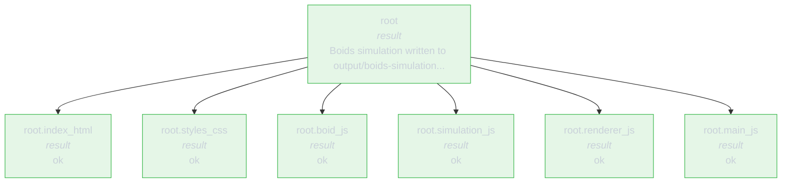

# rlmflow

<p align="center">
  <a href="https://pypi.org/project/rlmflow/"></a>
  <a href="https://github.com/shyamsn97/rlmflow/pkgs/container/rlmflow"></a>
</p>

A Python library for createing interactible, steppable graph [Recursive Language Models](https://arxiv.org/abs/2512.24601).

Recursive Language Models are powerful systems -- capable of handling long-context tasks by spawning sub-agents with their own fresh context windows. However. RLMs get messy fast: parents spawn children, children spawn more children, which also can run for multiple steps, etc.

**rlmflow** turns the run into an explicit graph. Every query, action,
observation, child call, wait, resume, and result is a typed, immutable
node you can step, inspect, fork, and replay.

<p align="center">
  
</p>

## RLMs as Graphs

RLMs delegate subtasks to
children, those children can delegate to their own children, and their results bubble back up. **rlmflow** represents this representation as a tree directory: every step inside an agent is a typed node and every
delegation is an edge between agents.

For example, this RLM code:

```python
h1 = delegate("search", "Find evidence", context=chunk_a)
h2 = delegate("verify", "Check the answer", context=chunk_b)
results = yield wait(h1, h2)
done(combine(results))
```

becomes this execution graph:

```text
Query(root)
  -> Action(root: delegate search + verify)
  -> Supervising(root: waiting on search, verify)
      -> Query(root.search)
      -> Result(root.search)
      -> Query(root.verify)
      -> Result(root.verify)
  -> Resume(root: search + verify results)
  -> Result(root)
```

## Install

```
pip install rlmflow               # core
pip install rlmflow[openai]       # + OpenAI client
pip install rlmflow[anthropic]    # + Anthropic client
pip install rlmflow[viewer]       # + Gradio viewer (plotly)
pip install rlmflow[image]        # + static image / GIF export (kaleido)
pip install rlmflow[all]          # all of the above
```

From source:

```
git clone https://github.com/shyamsn97/rlmflow && cd rlmflow
pip install -e .
```

## Quick start

This example is all you need for a simple and interpretable recursive coding agent. see [notebook](./examples/notebooks/coding_agent.ipynb)

```python
from rlmflow import OpenAIClient, RLMConfig, RLMFlow, Workspace
from rlmflow.runtime.local import LocalRuntime
from rlmflow.tools import FILE_TOOLS
from rlmflow.utils.trace import save_trace
from rlmflow.utils.viewer import open_viewer

workspace = Workspace.create("./myproject")
runtime = LocalRuntime(workspace=workspace)

# Sandbox agent code inside Docker instead: drop-in replacement,
# same interface.  Build the image once with `docker build -t rlmflow:local .`
# from the repo root; see docs/runtimes.md and docs/security.md.
#
# from rlmflow.runtime.docker import DockerRuntime
# runtime = DockerRuntime("rlmflow:local", workspace=workspace)

runtime.register_tools(FILE_TOOLS)

agent = RLMFlow(
    llm_client=OpenAIClient("gpt-5"),
    runtime=runtime,
    workspace=workspace,
    config=RLMConfig(max_depth=2, max_iterations=30),
    llm_clients={ # additional llm clients to be chosen to delegate
        "fast": {
            "model": OpenAIClient("gpt-5-mini"),
            "description": "Cheap model for smaller subtasks",
        },
    },
)

query = "Build a python text-based adventure game with combat and inventory."
states = [agent.start(query)]
while not states[-1].finished:
    states.append(agent.step(states[-1]))
    print(states[-1].tree())

save_trace(states, "traces/run1")
open_viewer(states)
```

`Workspace.create("./myproject")` writes a debuggable workspace as it runs:
`graph.jsonl` is the append-only node event log, `session/<agent-id>/` holds
per-call session views, and `context/<agent-id>/` holds payloads exposed as
`CONTEXT`. Saved traces are separate export artifacts and can live anywhere.

## Drop-in `LLMClient`

`RLMFlow` implements `LLMClient`, so it is a drop-in replacement for any LLM.

```python
def ask(llm: LLMClient, q: str) -> str:
    return llm.chat([{"role": "user", "content": q}])

ask(OpenAIClient("gpt-4o-mini"), "2+2?")             # one LLM call
ask(RLMFlow(llm_client=..., runtime=...), "2+2?")    # full agent, same return type
```

Nest agents by passing one `RLMFlow` as another's `llm_client`.

## Step and inspect

`step(node) -> node'` is one atomic graph transition. Every step returns a
new immutable `Node`, so the live tree is just `state.tree()`:

```python
state = agent.start(query)
while not state.finished:
    state = agent.step(state)
print(state.tree())
```

```text
root [supervising] {default}
├── root.scanner_auth [result] {fast} -> Found SQL injection in login.py
├── root.scanner_api  [supervising] {default}
│   ├── root.scanner_api.chunk_0 [result] {fast} -> Clean
│   └── root.scanner_api.chunk_1 [result] {fast} -> Payment flow is safe
└── root.scanner_db   [result] {fast} -> No issues found
```

Every transition follows the same shape:

```text
Observation -> LLM -> Action -> Runtime -> Observation     (REPL output)
                              -> done()  -> Result          (terminal answer)
                              -> wait()  -> Supervising     (waiting on children)
Supervising -> children done -> Resume   -> LLM  -> ...
```

`Observation`, `Action`, `Supervising`, `Resume`, and `Result` are all
typed Pydantic nodes. The graph is queryable in plain Python:

```python
state.tree()                                  # ASCII render
state.find("root.scanner_api")                # one node by id or agent_id
state.path_to("root.scanner_api.chunk_1")     # root → node ancestor chain
state.leaves()                                # every node with no children
state.errors()                                # every ErrorNode in the subtree
state.results()                               # every ResultNode in the subtree
state.where(type="action", agent_id="root")   # kwargs match node attrs
state.where(lambda n: n.depth > 2)            # or pass a predicate
state.model_dump_json()                       # full serialization
```

## Checkpoint, branch, replay

Every node is a frozen Pydantic snapshot, so the whole run is data:

```python
from rlmflow import Node

state.save(workspace.checkpoint_path)

# resume later, in another process, with a different model
state = Node.load(workspace.checkpoint_path)
agent = RLMFlow(llm_client=AnotherModel(), workspace=workspace, ...)
while not state.finished:
    state = agent.step(state)
```

To branch into an isolated workspace with its own session, context, and
working tree:

```python
alt = workspace.fork(new_branch_id="repair", new_dir="./runs/repair")
alt_agent = RLMFlow(llm_client=..., workspace=alt, ...)
```

Or intervene mid-run by replacing a child node before the parent resumes —
see [`examples/showcase.py`](examples/showcase.py) for checkpointing,
time travel, manual intervention, and gym-style stepping in one file.

## Rich visualization

See [notebook](./examples/notebooks/viz_walkthrough.ipynb) for a full showcase of vizualization utilities.

Because the run is a typed graph, every visualization is just a render of
that graph. The coding agent example
([`examples/coding-agent/agent.py`](examples/coding-agent/agent.py))
already exercises every option below — its saved trace under
`examples/data/notebook-coding-agent/` is the source for the renders here.


### Gradio viewer


`open_viewer(states)` launches a small browser app for stepping through a
saved trace — tree, summary, and raw node JSON side by side:

```python
from rlmflow.utils.trace import load_trace
from rlmflow.utils.viewer import open_viewer

trace = load_trace("examples/data/notebook-coding-agent/trace")
open_viewer(trace.states)
```

Or from a checkpoint via the CLI: `rlmflow view examples/data/notebook-coding-agent/trace`.

### Live terminal tree

`rlmflow.utils.viz.live(agent, state)` drives the step loop and renders a
Rich tree as nodes are produced. The boids run (`Create a simple boids
simulation in plain HTML and JavaScript, split each component into
separate files`) settles to:

```text
root [result] {default:gpt-5} -> Boids simulation written to output/boids-simulation with modular JS (boid, simulation, renderer) and index.html entrypoint.
  root.index_html    [result] {fast:gpt-5-mini} -> ok
  root.styles_css    [result] {fast:gpt-5-mini} -> ok
  root.boid_js       [result] {fast:gpt-5-mini} -> ok
  root.simulation_js [result] {fast:gpt-5-mini} -> ok
  root.renderer_js   [result] {fast:gpt-5-mini} -> ok
  root.main_js       [result] {fast:gpt-5-mini} -> ok
```

The same render is available offline as `state.tree()` on any node.
Filename-flavored agent ids (`index.html` → `index_html`) are sanitized
because `.` is the parent/child delimiter in the agent tree.

### Static renders

`rlmflow render <path> -f F` writes a static visualization in any of:

```text
mermaid             # stateDiagram-v2 (default topology)
mermaid-flowchart   # flowchart TD, better for wide trees
mermaid-sequence    # sequenceDiagram of delegate / wait / resume
dot · d2            # Graphviz / D2 topology
tree · ascii-boxes  # text trees
gantt-html          # standalone HTML swimlane
report-md           # full Markdown summary (tree + cost + result + errors)
code-log            # every code block paired with its observation
error-summary       # ErrorNode counts grouped by kind
tokens              # one-line ASCII sparkline of cumulative tokens
html                # self-contained interactive stepper, one slide per snapshot
image               # single PNG/SVG/PDF of the topology snapshot
steps               # one image per snapshot, written as step_NN.{png,svg,pdf}
```

```bash
rlmflow render examples/data/notebook-coding-agent/trace -f mermaid-flowchart
rlmflow render examples/data/notebook-coding-agent/trace -f gantt-html -o run.html
rlmflow render examples/data/notebook-coding-agent/trace -f report-md  -o run.md
rlmflow render examples/data/notebook-coding-agent/trace -f tokens
```

GitHub renders mermaid inline, so the output drops straight into a doc.
The example below is the `to_mermaid_flowchart(state)` projection of the
boids run; it renders reliably across the GitHub-supported mermaid
versions:



### Programmatic helpers

Everything the CLI does is one function call away:

```python
from rlmflow.utils.export import to_mermaid, to_mermaid_flowchart, to_mermaid_sequence, to_dot, to_d2
from rlmflow.utils.viz import (
    ascii_boxes, code_log, error_summary, message_stream, diff_system_prompts,
    gantt, gantt_html, token_sparkline, budget_burndown, bench_table,
    report_md, live, tee, slack_webhook, discord_webhook,
)
from rlmflow.utils.tracing import json_logs

print(token_sparkline(states))          # ▁▂▅█▂   15820 tok over 7 steps
print(error_summary(state))             # ErrorNode counts grouped by kind
print(message_stream("root.boid_js", session))   # rendered transcript for one agent
print(report_md(states, title="run"))   # full Markdown report
gantt_html(states, "run.html")          # standalone HTML swimlane
json_logs(states, "run.jsonl")          # one node per line
```

### Image, GIF, and HTML exports

For blog posts, PR comments, papers, and CI artifacts, render the
graph straight to a PNG/SVG/PDF, an animated GIF, or a single
self-contained HTML stepper. Four public functions live in
`rlmflow.utils`, plus matching CLI verbs:

| Function                                | CLI verb        | Output                                | Use case                                   |
|-----------------------------------------|-----------------|---------------------------------------|--------------------------------------------|
| `save_image(node, path)`                | `-f image`      | one PNG/SVG/PDF                       | hero image of a finished run               |
| `save_steps(states, dir/)`              | `-f steps`      | `step_NN.png` per snapshot            | blog slideshow, paper figure series        |
| `save_gif(states, path)`                | _(no verb yet)_ | animated GIF                          | quick preview / social posts               |
| `save_html(states, path)`               | `-f html`       | self-contained stepper (Plotly + CSS) | shareable URL-less artifact, PR comment    |

Quick start:

```python
from rlmflow.utils.trace import load_trace
from rlmflow.utils import save_image, save_steps, save_html, save_gif

trace = load_trace("examples/data/notebook-coding-agent/trace")
states = trace.states

save_image(states[-1], "trace_final.png")        # single snapshot
save_steps(states, "frames/")                    # one PNG per step
save_html(states, "trace.html", title="run 1")   # standalone stepper
save_gif(states, "trace.gif", duration=400)      # animated GIF (~2.5 fps)
```

Or use the node shorthand (same defaults):

```python
states[-1].save_image("trace_final.png")
states[-1].save_html("trace.html", states=states)
```

#### Why the scaling knobs exist

The on-screen Plotly figure is laid out for ~420 px tall, with 11 px
markers and 10 px labels — sized to look right on a Jupyter cell. A
naive 1800 px PNG export keeps those pixel sizes literal, so every
marker shrinks to a speck and every label to a thread.

The save helpers compensate with three knobs:

| Knob               | Default (image/steps/gif) | Default (html) | Effect                                                                                     |
|--------------------|---------------------------|----------------|---------------------------------------------------------------------------------------------|
| `element_mult`     | `3.0`                     | `2.0`          | Uniform multiplier on markers + edges + fonts. The simplest "make it bigger" knob.         |
| `marker_mult`      | _(inherits)_              | _(inherits)_   | Override just the marker size + edge width. Bump higher than `text_mult` on dense trees.    |
| `text_mult`        | _(inherits)_              | _(inherits)_   | Override just the label font size. Smaller text = fewer collisions when nodes are close.    |
| `normalize_labels` | `True`                    | `True`         | Force every label to `bottom center` so adjacent depths can't share a vertical band.        |

The HTML stepper additionally defaults to `height=720` (vs the
~420 px on-screen default) so its native marker sizes land in the
same proportion to the canvas as a `save_image` PNG.

`element_mult` is the lazy default; pass `marker_mult` and/or
`text_mult` to break the symmetry when labels are colliding even at
3× scale.

#### Recipes

**Hero PNG of a finished run** — defaults are tuned for this:

```python
states[-1].save_image("hero.png")
# == save_image(states[-1], "hero.png", width=1800, height=1350,
#               scale=2.0, element_mult=3.0, normalize_labels=True)
```

**Blog slideshow with dense subtrees** — fat markers, small labels,
square-ish canvas (the recipe behind `docs/blog.md`):

```python
save_steps(
    states,
    "blog/frames/",
    width=1600, height=1200, scale=2.0,
    marker_mult=3.5,        # fat node dots + edges
    text_mult=2.2,          # shrink labels so they don't collide
    normalize_labels=True,  # already the default — explicit for the reader
)
```

**Standalone interactive stepper** — drop into a PR comment or
GitHub gist:

```python
save_html(states, "stepper.html", title="needle haystack run")
```

The HTML output embeds Plotly from CDN, includes per-slide
transcripts, and ships keyboard navigation (← / →) plus dot-style
slide indicators. Open it in any browser, attach it to an email,
upload it as a CI artifact — it works offline once the CDN script
is cached.

**Animated GIF** — needs `pip install rlmflow[image] pillow`:

```python
save_gif(
    states,
    "trace.gif",
    duration=600,          # ms per frame; lower = faster
    loop=0,                # 0 = forever; 1 = play once
    width=1200, height=900,
    element_mult=2.0,
)
```

#### From the CLI

Every knob above maps 1:1 to a CLI flag:

```bash
# blog slideshow recipe (matches the dense-tree recipe above)
rlmflow render examples/data/notebook-coding-agent/trace \
  -f steps -o blog/frames/ \
  --width 1600 --height 1200 --scale 2.0 \
  --marker-mult 3.5 --text-mult 2.2

# self-contained interactive stepper
rlmflow render examples/data/notebook-coding-agent/trace \
  -f html  -o stepper.html --title "boids walkthrough"

# single hero PNG with default scaling
rlmflow render examples/data/notebook-coding-agent/trace \
  -f image -o hero.png

# opt out of label normalization (matches Gradio viewer defaults)
rlmflow render examples/data/notebook-coding-agent/trace \
  -f html  -o stepper.html --no-normalize-labels
```

The CLI auto-picks `element_mult=2.0` for `-f html` (so the live
stepper's native 14 px markers stay readable) and `element_mult=3.0`
for `-f image` / `-f steps` (where the much larger PNG canvas would
otherwise shrink markers to specks). Node sizes are uniform; token
counts stay in hover/details, not marker size. Override either with
`--element-mult`.

#### Dependencies

- `save_image` / `save_steps` need `kaleido`. Install with
  `pip install rlmflow[image]` or just `pip install kaleido`.
- `save_gif` additionally needs `Pillow`
  (`pip install rlmflow[image] pillow`).
- `save_html` and `render_html` have **no static-image dependency** —
  they emit a single HTML file that embeds Plotly from CDN.

## Examples

All examples share flags like `--no-viz`, `--docker-image rlmflow:local`,
`--max-depth`, and `--max-iterations`. See [`examples/README.md`](examples/README.md).

| Example | What it shows |
|---|---|
| [`showcase.py`](examples/showcase.py) | Typed nodes, checkpoints, session persistence, intervention, gym-style stepping. |
| [`drop_in_llm.py`](examples/drop_in_llm.py) | `RLMFlow` as an `LLMClient`. Nested agents. |
| [`coding-agent/agent.py`](examples/coding-agent/agent.py) | Interactive coding agent that writes and edits files. |
| [`needle_haystack.py`](examples/needle_haystack.py) | Needle-in-a-haystack across 500 files with custom tools and `runtime_factory`. |
| [`summarizer.py`](examples/summarizer.py) | Recursive map-reduce over a long document. |
| [`view_demo.py`](examples/view_demo.py) | Launch the Gradio viewer on a saved trace. |
| [`notebooks/coding_agent.ipynb`](examples/notebooks/coding_agent.ipynb) | Build the agent, run the boids task end-to-end, open the interactive viewer. **Source of `examples/data/notebook-coding-agent/`** — every other notebook reads from here. |
| [`notebooks/viz_walkthrough.ipynb`](examples/notebooks/viz_walkthrough.ipynb) | All 9 visualizations against the saved boids trace: inline tree, interactive viewer, topology renders (mermaid/dot/d2/sequence), step-indexed timeline, per-node detail (`message_stream`, `diff_system_prompts`), cost & reports, run-vs-run comparison, CLI equivalents. |
| [`notebooks/node_basics.ipynb`](examples/notebooks/node_basics.ipynb) | `Node` API tour — walk, find, path_to, filter (`leaves`/`results`/`errors`/`where`), diff snapshots, session access (`FileSession.load`, `chain_to`), event streaming with `tee` / `json_logs`. |

## Benchmarks

A runnable RLM-vs-flat harness for **OOLONG** (long-context aggregation,
~250k tokens) lives under [`benchmarks/oolong/`](benchmarks/oolong/).
It mirrors Prime Intellect's reference environment but talks directly
to `rlmflow` instead of `verifiers`. Three modes — `standard` (one big
flat call), `rlm` (recursive scaffold), `rlm_tips` (recursive +
chunking hints) — across `synth`, `synth_with_labels`, and `real`
subsets, scored deterministically against the published gold answers.

```bash
python benchmarks/oolong/run.py --mode rlm --subset synth --limit 50
python benchmarks/oolong/aggregate.py --runs runs/oolong-*
```

See [`benchmarks/oolong/README.md`](benchmarks/oolong/README.md) for
flags, scoring details, and ablation scripts.

## CLI

```
rlmflow view traces/run1/
rlmflow render checkpoint.json -f mermaid
rlmflow render traces/run1/ -f gantt-html -o run1.html
rlmflow render traces/run1/ -f html       -o stepper.html
rlmflow render traces/run1/ -f steps      -o frames/  --marker-mult 3.5 --text-mult 2.2
rlmflow render traces/run1/ -f image      -o trace.png
rlmflow version
```

`view` and `render` accept a trace directory, `trace.json`, or checkpoint.
`render -f` accepts: `mermaid`, `mermaid-flowchart`, `mermaid-sequence`,
`dot`, `d2`, `tree`, `ascii-boxes`, `gantt-html`, `report-md`, `code-log`,
`error-summary`, `tokens`, `html`, `image`, `steps` — see the
[Static renders](#static-renders) table and [Image, GIF, and HTML
exports](#image-gif-and-html-exports) for what each produces and the
scaling / label-normalization flags (`--marker-mult`, `--text-mult`,
`--normalize-labels` / `--no-normalize-labels`).

## Todo


## Docs
- [Blog post](docs/blog.md): the long-form pitch — why recursive
  language models, why graphs over flat traces, full needle-in-a-haystack
  walkthrough with the same exports the CLI ships.
- [Positioning](docs/positioning.md): when to use rlmflow vs rlm-minimal,
  ypi, LangGraph, CrewAI, AutoGen, SWE-agent, Aider — decision matrix and
  per-framework comparisons.
- [Observability](docs/observability.md): node fields and types, save/load
  traces, session/context layout, live tree, gantt, topology exports,
  Gradio viewer, CLI.
- [Control](docs/control.md): step loop, checkpoint, rewind, fork
  (`Workspace.fork`, `CONTEXT.fork()`), `delegate(name, query, context)`,
  inline-first strategy, intervention, custom prompts, runtimes, tools.
- [Runtimes](docs/runtimes.md): `Runtime` protocol, shipped runtimes
  (Local / Subprocess / Docker / Modal), writing your own.
- [Security](docs/security.md): trust model, Docker isolation knobs,
  engine-level caps, proxied tools, approval gates.
- [Changelog](CHANGELOG.md): release-by-release changes, including the
  upcoming `delegate(...)` mandatory-`context` break.

## References

- [Recursive Language Models](https://github.com/alexzhang13/rlm): the
  original RLM paper and implementation.
- [rlm-minimal](https://github.com/alexzhang13/rlm-minimal): the
  single-file reference rlmflow grew from.
- [Scaling Managed Agents: Decoupling the brain from the hands](https://www.anthropic.com/engineering/managed-agents):
  Anthropic's writeup on separating harness, session, and sandbox
  interfaces for long-horizon agents.
- [ypi](https://github.com/rawwerks/ypi): recursive coding agent built
  on Pi. Our session layout and much of the default prompt
  (size-up → delegate → combine, guardrails, aggressive delegation) come
  from ypi's `SYSTEM_PROMPT.md`.

## License

See [LICENSE](LICENSE).

## Citation

```bibtex
@misc{sudhakaran2025rlmflow,
  author = {Sudhakaran, Shyam},
  title = {rlmflow},
  year = {2025},
  publisher = {GitHub},
  journal = {GitHub repository},
  howpublished = {\url{https://github.com/shyamsn97/rlmflow}},
}
```
