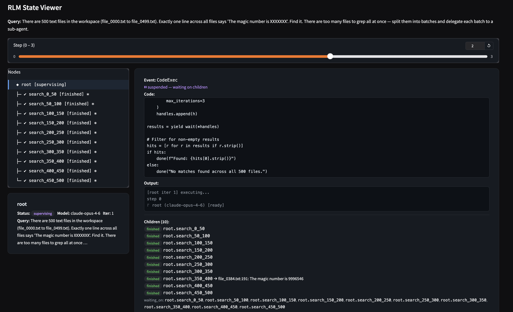

# rlmkit

A framework for building [Recursive Language Model](https://github.com/alexzhang13/rlm-minimal) agents as state machines. Every agent — root and all descendants — advances one step at a time, and the entire computation tree is a single immutable, serializable object at every step boundary.

<p align="center">
  
</p>


## Quick Start

Here's all you need for a minimal recursive coding agent

```python
from rlmkit.llm import OpenAIClient
from rlmkit.rlm import RLM, RLMConfig
from rlmkit.runtime.local import LocalRuntime
from rlmkit.tools import FILE_TOOLS
from rlmkit.utils.viewer import save_trace, open_viewer

runtime = LocalRuntime(workspace="./myproject")
runtime.register_tools(FILE_TOOLS)

agent = RLM(
    llm_client=OpenAIClient("gpt-5"),
    runtime=runtime,
    config=RLMConfig(max_depth=3, max_iterations=15, session="context"),
)

query = "Find and fix all type errors in src/"
states = [agent.start(query)]
while not state.finished:
    state = agent.step(state)
    state.append(state)
    print(state.tree()) # print the current tree

# save_trace(states, "traces/") save the trace
open_viewer(states, query=query) # open interactive viewer
```

## Installation

### from pip

```
pip install rlmkit
```

### from source

```
git clone https://github.com/shyamsn97/rlmkit
cd rlmkit
pip install -e .
```

## The Idea

An LLM with a code REPL can recursively spawn sub-agents to handle pieces of a problem in parallel. rlmkit makes this tree a **state machine** — every agent advances one step at a time, and the entire computation is one object you can inspect, checkpoint, fork, or serialize at any step boundary. Call `state.tree()` to see it:

```
root [supervising] iter 5
├── root.scanner_auth [finished] iter 3 → "Found SQL injection in login.py"
│   ├── root.scanner_auth.chunk_0 [finished] iter 2 → "No issues"
│   ├── root.scanner_auth.chunk_1 [finished] iter 2 → "SQL injection on line 42"
│   └── root.scanner_auth.chunk_2 [finished] iter 2 → "No issues"
├── root.scanner_api [supervising] iter 3
│   ├── root.scanner_api.chunk_0 [ready] iter 1
│   ├── root.scanner_api.chunk_1 [finished] iter 2 → "Clean"
│   │   └── root.scanner_api.chunk_1.deep_scan [finished] iter 2 → "Payment flow is safe"
│   └── root.scanner_api.chunk_2 [finished] iter 2 → "Clean"
└── root.scanner_db [finished] iter 2 → "No issues found"
```

Or: `result = agent.run("Find and fix all type errors in src/")`

`start()` accepts an optional query — if omitted, a generic default prompt is used.

## How It Works

Each `step(state) → state'` is one atomic transition. Steps are granular — each call advances exactly one phase, so intermediate states (SUPERVISING, children progressing) are always visible:

```
        step_llm()              step_exec()
READY ─────────────> EXECUTING ─────────────> SUPERVISING
  ^                      |                        |
  |                   done()                step_children()
  |                      |                   (one batch)
  |                      v                        |
  |                  FINISHED <── resume_exec() ──┤
  |                      ^                        |
  |                      |                  children not done
  +── yields again ──────┘                   (keep stepping)
```

1. **READY** — agent is queued for its next LLM call
2. **EXECUTING** — LLM replied with a code block; the engine runs it (same step as LLM call)
3. **SUPERVISING** — code called `delegate()` + `yield wait()`; children are running. Each `step()` advances children by one batch — you see the tree evolve
4. **Resume** — all children finished; parent generator resumes with their results
5. **FINISHED** — code called `done(result)`; agent is complete

**Delegation:**

```python
h1 = delegate("searcher", "Find all TODOs in src/")
h2 = delegate("searcher", "Find all FIXMEs in src/")  # auto-suffixed: root.searcher_2
results = yield wait(h1, h2)
done(f"Found {len(results)} batches")
```

Re-delegating to a finished child resumes it with a new task — same REPL variables, fresh context window.

## What You Can Do

Because state is immutable and serializable, you get things for free that are hard in other frameworks (all demonstrated in [`showcase.py`](examples/showcase.py)):

- **Checkpoint & resume** — `state.model_dump_json()` at any step, `model_validate_json()` to restore ([§2](examples/showcase.py#L100-L114))
- **Fork** — branch from a checkpoint to try a different approach ([§3](examples/showcase.py#L116-L152))
- **Session persistence** — `write_tree` / `from_session` round-trip for message histories ([§4](examples/showcase.py#L154-L166))
- **Time travel** — keep a list of states, rewind to any point ([§5](examples/showcase.py#L168-L183))
- **Intervene** — inspect children between steps, kill bad branches, inject hints ([§6](examples/showcase.py#L186-L216))
- **Gym-style loop** — wrap `step()` for RL training with reward signals ([§7](examples/showcase.py#L218-L242))

## `RLMState`

Frozen, recursive Pydantic model — the entire computation in one object:

```python
state.agent_id      # "root", "root.search_0", "root.search_0.chunk_2"
state.query         # the query string
state.status        # READY | EXECUTING | SUPERVISING | FINISHED
state.iteration     # current step count
state.event         # last StepEvent — LLMReply, CodeExec, ResumeExec, or NoCodeBlock
state.messages      # full LLM message history (assistant messages reflect extracted code)
state.system_prompt # resolved system prompt for this step (tracks dynamic prompts)
state.result        # final result (when finished)
state.children      # list[RLMState] — recursive
state.finished      # shorthand for status == FINISHED
state.tree()        # render the full tree as a string (color=True by default)
```

## Core API

### `RLM`

```python
agent = RLM(
    llm_client=llm,            # LLMClient — or use OpenAIClient / AnthropicClient
    runtime=runtime,           # Runtime (LocalRuntime for in-process exec)
    config=RLMConfig(
        max_depth=5,           # recursion limit
        max_iterations=30,     # steps per agent
        max_concurrency=8,     # global parallel cap
        session="context",     # session persistence (str path, Session object, or None)
    ),
    pool=ThreadPool(8),        # execution pool (ThreadPool, SequentialPool, or custom)
    llm_clients={...},         # named model registry for delegate(model="fast")
)

state = agent.start("query")       # query defaults to a generic prompt if omitted
state = agent.step(state)          # one transition
result = agent.run("query")        # run to completion
```

Override any method: `step`, `step_llm`, `step_exec`, `build_system_prompt`, `build_messages`, `extract_code`, `create_child`.

### `LLMClient`

```python
from rlmkit.llm import OpenAIClient, AnthropicClient, LLMClient

llm = OpenAIClient("gpt-5")                    # lazy import — no hard dependency
llm = AnthropicClient("claude-sonnet-4-20250514")

class MyLLM(LLMClient):                        # or roll your own
    def chat(self, messages): ...
```

### `Runtime`

The base `Runtime` is minimal — `execute(code)`, `inject(name, value)`, `clone()`, plus tool registration. No file I/O, no workspace. `LocalRuntime` runs Python in-process with a persistent namespace. Common modules (`re`, `os`, `json`, `math`, etc.) are pre-imported. Variables persist across REPL turns.

```python
from rlmkit.runtime.local import LocalRuntime

runtime = LocalRuntime()
```

Register custom tools:

```python
@runtime.tool("Search for a regex pattern across files.")
def search(pattern: str, path: str = ".") -> str:
    ...
```

### Resume

Save state at any point. Resume later from a fresh engine.

```python
# Save
Path("checkpoint.json").write_text(state.model_dump_json())

# Resume (workspace and session should already be in place)
saved = RLMState.model_validate_json(Path("checkpoint.json").read_text())
state = agent.resume(saved)
while not state.finished:
    state = agent.step(state)
```

The LLM gets a synthetic message with the task, previous tree summary, and recent session history. It inspects the workspace and picks up where the previous run left off.

### Sessions

Persist agent message histories so agents can read their own or each other's past:

```python
agent = RLM(..., config=RLMConfig(session="context/"))
# Tools: list_sessions(), read_history(agent_id=None, last_n=20)
```

Custom backends — subclass `Session` with `write`, `read`, `list_agents`, `exists`.

### Model Selection

```python
agent = RLM(
    llm_client=OpenAIClient("gpt-5"),
    llm_clients={
        "fast": {"model": OpenAIClient("gpt-5-mini"), "description": "Cheap, for simple tasks"},
    },
    ...
)
# Agent sees available models in its prompt and can: delegate("search", query, model="fast")
```

## Visualization

rlmkit includes an interactive state viewer built on Gradio. Click through steps with a slider, click nodes in the tree, and inspect messages, events, and diffs.

<p align="center">
  
</p>

```python
from rlmkit.utils.viewer import open_viewer, save_trace, load_trace, view_trace

# Open the viewer on a list of states
open_viewer(states, query="Find the magic number")

# Save a trace to disk (JSON file or directory)
save_trace(states, "traces/run1", query="Find the magic number", metadata={"answer": "42"})

# Load and view a saved trace
states, query, metadata = load_trace("traces/run1")
view_trace("traces/run1")
```

The viewer shows color-coded messages: assistant (green), execution (purple), and resume (amber). Code blocks in assistant messages always reflect the code that actually ran — if `extract_code` transforms the code, the stored message is updated to match.

## Extending

**Custom prompts and state:**

```python
class SecurityAuditor(RLM):
    def __init__(self, **kwargs):
        super().__init__(**kwargs)
        self.prompt_builder = (
            make_default_builder()
            .section("role", "You are a security auditor.", title="Role")
            .remove("examples")
        )

class ReviewState(RLMState):
    findings: list[str] = []

class CodeReviewer(RLM):
    state_cls = ReviewState

    def step_exec(self, state):
        new_state = super().step_exec(state)
        if isinstance(new_state.event, CodeExec) and "issue" in new_state.event.output.lower():
            return new_state.update(findings=state.findings + [new_state.event.output])
        return new_state
```

**Code extraction and instrumentation:** Override `extract_code` to transform code before execution. The assistant message is automatically updated to reflect the transformed code, so the message trace never diverges from what actually ran.

```python
class LoggingRLM(RLM):
    def extract_code(self, text, state=None):
        code = self.parse_code(text)
        if code is None or state is None:
            return code
        header = f'print("[{state.agent_id} iter {state.iteration}] executing...")'
        return header + "\n" + code
```

`parse_code` extracts the raw code block; `extract_code` is the hook for transforms. Child agents inherit the override via `self.__class__`.

## Examples

All examples show a live tree visualization by default. Pass `--no-viz` for plain output.

| Example | What it shows |
|---------|--------------|
| [`showcase.py`](examples/showcase.py) | Checkpointing, forking, session persistence, time travel — the full API tour |
| [`agent.py`](examples/coding-agent/agent.py) | Interactive coding agent REPL — give it tasks, it writes and edits files |
| [`needle_haystack.py`](examples/needle_haystack.py) | Needle-in-a-haystack across 500 files with custom tools and `runtime_factory` |
| [`summarizer.py`](examples/summarizer.py) | Recursive map-reduce: chunk a 10k-line doc, summarize in parallel, combine results |

## Project Structure

```
rlmkit/
├── rlm.py           # RLM engine, RLMConfig, step logic, resume
├── state.py         # RLMState, Status, StepEvent hierarchy
├── pool.py          # Pool ABC, ThreadPool, SequentialPool
├── session.py       # Session ABC, FileSession
├── llm.py           # LLMClient ABC, OpenAIClient, AnthropicClient
├── utils/
│   ├── utils.py     # @tool decorator, code block parsing, replace_code_block
│   ├── viewer.py    # Gradio state viewer, save_trace, load_trace, view_trace
│   └── viz.py       # Live terminal tree (Rich)
├── runtime/
│   ├── runtime.py   # Runtime ABC, ToolDef (minimal — no file I/O)
│   ├── local.py     # LocalRuntime (in-process via REPL)
│   ├── repl.py      # REPL (code execution, stdout capture, ANSI stripping)
│   └── modal.py     # ModalRuntime (remote via Modal containers)
└── prompts/
    ├── builder.py   # PromptBuilder, Section
    ├── default.py   # Default prompt sections
    └── messages.py  # Message templates, DEFAULT_QUERY
```

## References

- [Recursive Language Models](https://github.com/alexzhang13/rlm) — the original RLM paper and implementation. The core idea — an LLM with a REPL that can call itself via `llm_query()` — is the foundation of everything here.
- [rlm-minimal](https://github.com/alexzhang13/rlm-minimal) — minimal single-file Python RLM. rlmkit started as a refactored version of this, pulling it apart into a step-based state machine.
- [ypi](https://github.com/rawwerks/ypi) — recursive coding agent built on Pi. Our session structure (directory tree mirroring the agent hierarchy) and much of the default prompt (size-up → delegate → combine, guardrails around child result formatting, the emphasis on aggressive delegation) are directly inspired by ypi's `SYSTEM_PROMPT.md`.

## License

See [LICENSE](LICENSE).

## Citation

```bibtex
@misc{sudhakaran2025rlmkit,
  author = {Sudhakaran, Shyam},
  title = {rlmkit},
  year = {2025},
  publisher = {GitHub},
  journal = {GitHub repository},
  howpublished = {\url{https://github.com/shyamsn97/rlmkit}},
}
```
