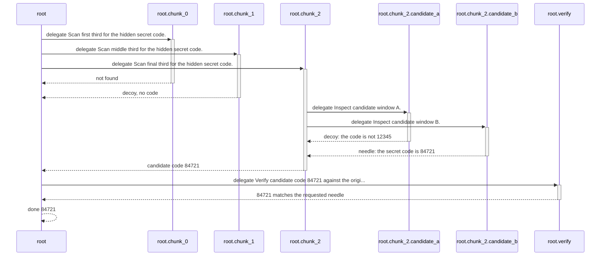
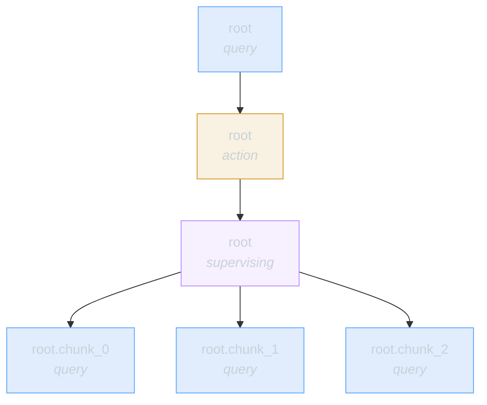
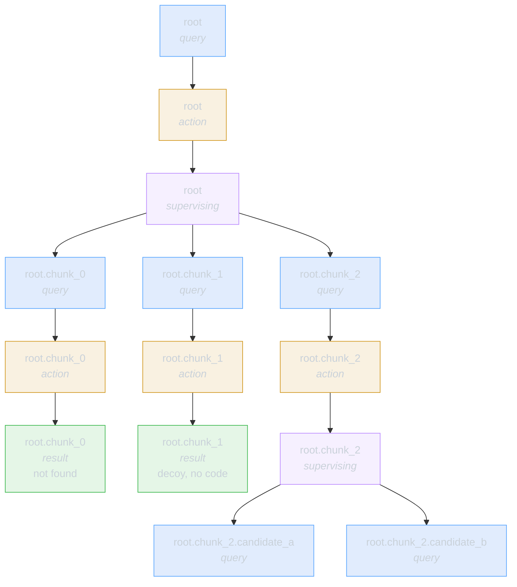
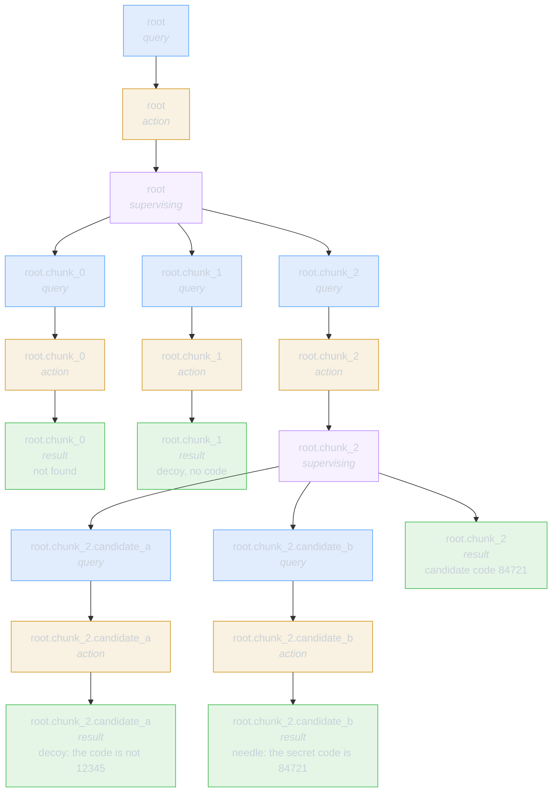
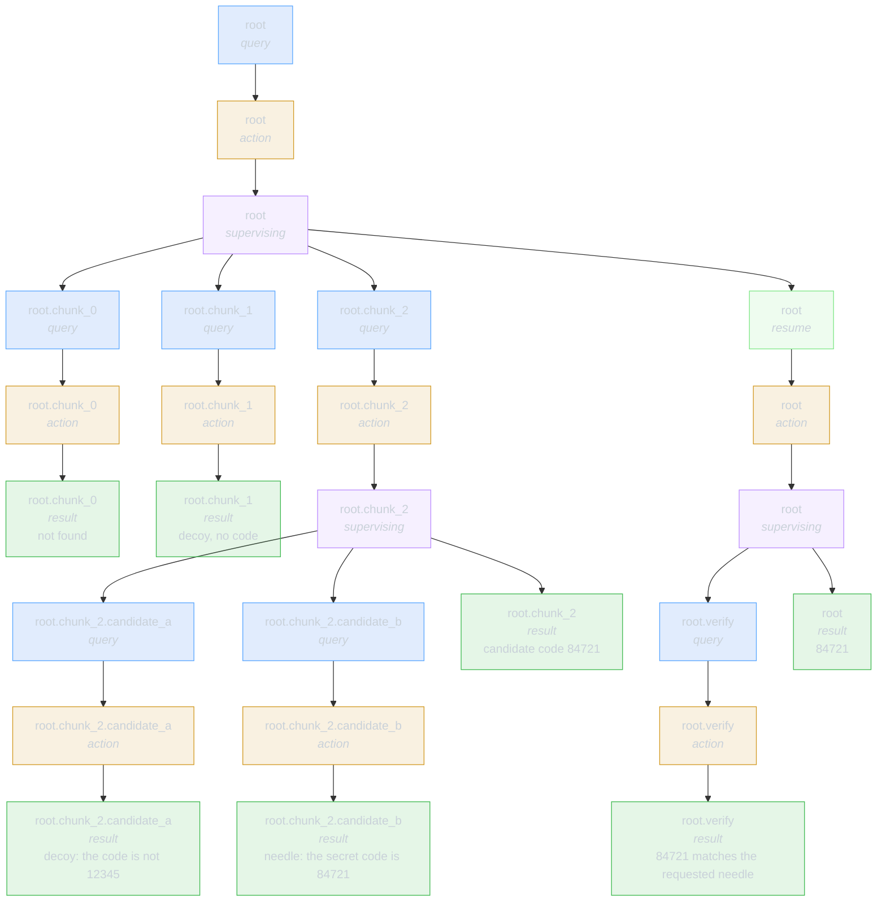

# Generated Needle Graph Example

## Collapsed RLM View

This is what the run looks like if recursive calls collapse to strings:

```text
root
  call_llm("scan first third")  -> not found
  call_llm("scan middle third") -> decoy, no code
  call_llm("scan final third")  -> candidate code 84721
  call_llm("verify candidate")  -> 84721 matches the requested needle
  final answer                  -> 84721
```

## Sequence View

This is the same run as calls and returns:



## Steppable Graph Snapshots

### 1. Root parks after spawning parallel children



### 2. First children finish while chunk_2 keeps working



### 3. chunk_2 resumes from candidate readers



### 4. Root resumes and returns the answer


