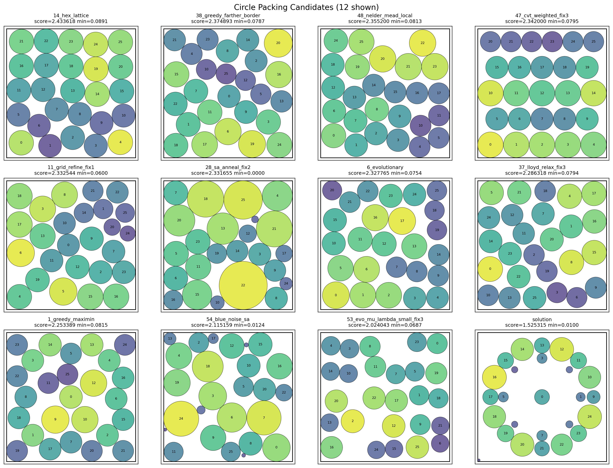

# Circle Packing Autoresearch Report

Source ledger: `../runs/autoresearch/history/ledger.jsonl`

Target: pack exactly 26 non-overlapping circles in the unit square `[0, 1]^2`.
Score is `sum(radii)`, so higher is better.



## Executive Summary

The run found a strong candidate, `hex_lattice`, with score `2.433618`.
That is a `+0.908303` absolute improvement over the baseline score `1.525315`,
or about `+59.55%` relative improvement. Compared with the quoted known best
for `n=26` of about `2.635`, the best candidate reaches about `92.36%` of that
target, leaving a gap of roughly `0.201382`.

The strongest families in this run were `hex_lattice`, `greedy_farther_border`, `nelder_mead_local`, `cvt_weighted`, `grid_refine`, `sa_anneal`, `evolutionary`.
Most high-scoring approaches used structured center placement or local search, then computed radii from exact clearance.
That pattern kept feasibility high while improving substantially over the baseline.

## Run Overview

| Metric | Value |
| --- | ---: |
| Total ledger rows | 65 |
| Experiment submissions | 64 |
| Scored valid submissions | 60 |
| Failed submissions | 4 |
| Baseline score | 1.525315 |
| Best score | 2.433618 |
| Best run | `#14 hex_lattice` |
| Improvement over baseline | +0.908303 |
| Relative improvement | +59.55% |
| Gap to known best `~2.635` | 0.201382 |

## Best Attempt By Algorithm

| Rank | Algorithm | Best run | Score | Min radius | Max radius | Elapsed |
| ---: | --- | ---: | ---: | ---: | ---: | ---: |
| 1 | `hex_lattice` | `#14` | 2.433618 | 0.089067 | 0.096299 | 0.48s |
| 2 | `greedy_farther_border` | `#38` | 2.374893 | 0.078697 | 0.109611 | 0.75s |
| 3 | `nelder_mead_local` | `#48` | 2.355200 | 0.081300 | 0.103287 | 0.56s |
| 4 | `cvt_weighted` | `#47` | 2.342000 | 0.079500 | 0.099500 | 0.40s |
| 5 | `grid_refine` | `#11` | 2.332544 | 0.060000 | 0.107005 | 0.50s |
| 6 | `sa_anneal` | `#28` | 2.330597 | 0.000000 | 0.186751 | 28.41s |
| 7 | `evolutionary` | `#6` | 2.327765 | 0.075444 | 0.105268 | 0.94s |
| 8 | `lloyd_relax` | `#37` | 2.286318 | 0.079413 | 0.096946 | 0.45s |
| 9 | `greedy_maximin` | `#1` | 2.253389 | 0.081479 | 0.106620 | 0.47s |
| 10 | `blue_noise_sa` | `#54` | 2.115159 | 0.012357 | 0.136376 | 7.19s |
| 11 | `evo_mu_lambda_small` | `#53` | 2.064411 | 0.061654 | 0.095825 | 0.52s |
| 12 | `pairwise_proj` | `#62` | 1.995398 | 0.069098 | 0.085817 | 0.38s |
| 13 | `poisson_disk_seed` | `#18` | 1.944097 | 0.002271 | 0.151434 | 0.51s |
| 14 | `pairwise_shake` | `#5` | 1.847341 | 0.000000 | 0.185116 | 0.62s |
| 15 | `voronoi_inflate` | `#42` | 1.816002 | 0.000000 | 0.187437 | 1.87s |
| 16 | `trust_region_barrier` | `#58` | 1.258188 | 0.024177 | 0.108736 | 0.45s |
| - | `baseline` | `#0` | 1.525315 | 0.010000 | 0.093455 | 0.47s |

## Results By Strategy Family

| Family | Attempts | Scored | Best run | Best score | Delta vs baseline | Notes |
| --- | ---: | ---: | --- | ---: | ---: | --- |
| `hex_lattice` | 4 | 4 | `#14` | 2.433618 | +0.908303 | fixes repeated the same score. |
| `greedy_farther_border` | 4 | 1 | `#38` | 2.374893 | +0.849578 | 3 failed attempt(s). |
| `nelder_mead_local` | 2 | 2 | `#48` | 2.355200 | +0.829885 | fixes repeated the same score. |
| `cvt_weighted` | 4 | 4 | `#47` | 2.342000 | +0.816685 | valid family result. |
| `grid_refine` | 4 | 4 | `#11` | 2.332544 | +0.807229 | valid family result. |
| `sa_anneal` | 4 | 4 | `#28` | 2.330597 | +0.805282 | degenerate/near-zero radius present. |
| `evolutionary` | 4 | 4 | `#6` | 2.327765 | +0.802450 | valid family result. |
| `lloyd_relax` | 12 | 12 | `#37` | 2.286318 | +0.761003 | family name reused across batches. |
| `greedy_maximin` | 1 | 1 | `#1` | 2.253389 | +0.728074 | valid family result. |
| `blue_noise_sa` | 4 | 4 | `#54` | 2.115159 | +0.589844 | valid family result. |
| `evo_mu_lambda_small` | 4 | 4 | `#53` | 2.064411 | +0.539096 | valid family result. |
| `pairwise_proj` | 3 | 2 | `#62` | 1.995398 | +0.470083 | 1 failed attempt(s); fixes repeated the same score. |
| `poisson_disk_seed` | 4 | 4 | `#18` | 1.944097 | +0.418782 | valid family result. |
| `pairwise_shake` | 4 | 4 | `#5` | 1.847341 | +0.322026 | degenerate/near-zero radius present. |
| `voronoi_inflate` | 2 | 2 | `#42` | 1.816002 | +0.290687 | degenerate/near-zero radius present; fixes repeated the same score. |
| `trust_region_barrier` | 4 | 4 | `#58` | 1.258188 | -0.267127 | valid family result. |

## Failure Analysis

There were `4` failed submissions:

- `#39 greedy_farther_border_fix1`: INVALID: IndentationError at line 263:4: unexpected indent. Source: 'return centers, radii'
- `#40 greedy_farther_border_fix2`: INVALID: IndentationError at line 263:4: unexpected indent. Source: 'return centers, radii'
- `#41 greedy_farther_border_fix3`: INVALID: IndentationError at line 263:4: unexpected indent. Source: 'return centers, radii'
- `#63 pairwise_proj_fix1`: INVALID: `solve()` raised; see traceback above

The run also spent budget on several `_fixN` attempts after an already-valid numeric score.
For this benchmark, a child should usually stop after producing a valid score and let the parent decide whether to explore that family again.

Some valid submissions are semantically weak despite passing the evaluator, especially rows with `min_r = 0` or near-zero radii.
The parent should treat those as low-priority even when `sum(radii)` is nonzero.

## Behavior Notes

- The parent used the full `--max-submissions 64` budget and stopped when `remaining_submissions` reached zero.
- The initial batch covered eight distinct algorithms, then the parent recovered from a zero-handle `rlm_wait` mistake by generating fresh slugs.
- Child retry behavior was productive overall, but occasionally repeated identical scores or repeated the same syntax failure.
- The best result came from a simple geometric `hex_lattice` family, suggesting structured seeds remain a strong baseline for later hybrid approaches.

## Recommendations

1. Preserve `#14 hex_lattice` as the current best candidate.
2. Use `hex_lattice` as a strong seed for future local-search or gradient-polish experiments.
3. Try combining the balanced high-score families (`hex_lattice`, `greedy_farther_border`, `nelder_mead_local`, `cvt_weighted`) rather than spending more retries on weak families.
4. Add a parent-side rule: after a child returns a valid numeric score, do not run `_fixN` unless explicitly attempting a refinement, not a repair.
5. Avoid zero-handle waits by ending or proposing fresh slugs when every planned idea has already been used.
6. Penalize or discard candidates with `min_r` near zero during parent selection.

To regenerate the exact visualization:

```bash
python examples/autoresearch/runs/autoresearch/plot_circles.py \
  examples/autoresearch/runs/autoresearch/history/14_hex_lattice.py \
  examples/autoresearch/runs/autoresearch/history/38_greedy_farther_border.py \
  examples/autoresearch/runs/autoresearch/history/48_nelder_mead_local.py \
  examples/autoresearch/runs/autoresearch/history/47_cvt_weighted_fix3.py \
  examples/autoresearch/runs/autoresearch/history/11_grid_refine_fix1.py \
  examples/autoresearch/runs/autoresearch/history/28_sa_anneal_fix2.py \
  examples/autoresearch/runs/autoresearch/history/6_evolutionary.py \
  examples/autoresearch/runs/autoresearch/history/37_lloyd_relax_fix3.py \
  examples/autoresearch/runs/autoresearch/history/1_greedy_maximin.py \
  examples/autoresearch/runs/autoresearch/history/54_blue_noise_sa.py \
  examples/autoresearch/runs/autoresearch/history/53_evo_mu_lambda_small_fix3.py \
  examples/autoresearch/runs/autoresearch/solution.py \
  --cols 4 \
  --out examples/autoresearch/circle_packing/top11_families_plus_baseline.png
```
