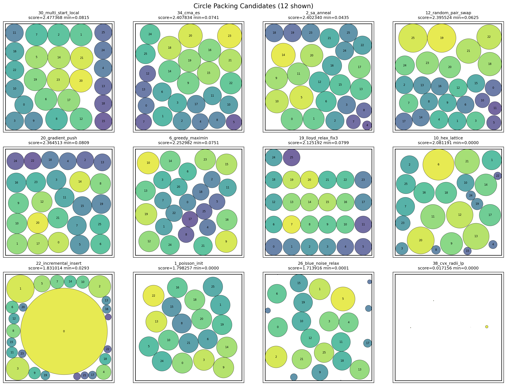

# Circle Packing Autoresearch Report

Source ledger: `../runs/autoresearch/history/ledger.jsonl`

Target: pack exactly 26 non-overlapping circles in the unit square `[0, 1]^2`.
Score is `sum(radii)`, so higher is better.



## Executive Summary

The run found a strong candidate, `multi_start_local`, with score `2.477368`.
That is a `+0.952053` absolute improvement over the baseline score `1.525315`,
or about `+62.42%` relative improvement. Compared with the quoted known best
for `n=26` of about `2.635`, the best candidate reaches about `94.02%` of that
target, leaving a gap of roughly `0.157632`.

The most promising families were local search over center positions with exact
clearance radii: `multi_start_local`, `cma_es`, `sa_anneal`,
`random_pair_swap`, and `gradient_push`. These all share the same reliable
pattern: optimize centers only, then compute each radius from the minimum of
wall clearance and half-nearest-neighbor distance. This makes feasibility
easy to preserve and kept most trials valid.

## Run Overview

| Metric | Value |
| --- | ---: |
| Total ledger rows | 42 |
| Scored valid trials | 39 |
| Failed trials | 3 |
| Baseline score | 1.525315 |
| Best score | 2.477368 |
| Best run | `#30 multi_start_local` |
| Improvement over baseline | +0.952053 |
| Relative improvement | +62.42% |
| Gap to known best `~2.635` | 0.157632 |

## Best Attempt By Algorithm

| Rank | Algorithm | Best run | Score | Min radius | Max radius | Elapsed |
| ---: | --- | ---: | ---: | ---: | ---: | ---: |
| 1 | `multi_start_local` | `#30` | 2.477368 | 0.084612 | 0.106995 | 0.86s |
| 2 | `cma_es` | `#34` | 2.407834 | 0.074050 | 0.114746 | 0.42s |
| 3 | `sa_anneal` | `#2` | 2.402340 | 0.043531 | 0.112789 | 0.80s |
| 4 | `random_pair_swap` | `#12` | 2.395524 | 0.060752 | 0.125172 | 0.64s |
| 5 | `gradient_push` | `#20` | 2.364513 | 0.080886 | 0.097431 | 0.21s |
| 6 | `greedy_maximin` | `#6` | 2.252982 | 0.075051 | 0.103618 | 0.59s |
| 7 | `lloyd_relax` | `#19` | 2.125192 | 0.079900 | 0.083890 | 0.16s |
| 8 | `hex_lattice` | `#10` | 2.081191 | 0.000000 | 0.146929 | 0.90s |
| 9 | `incremental_insert` | `#22` | 1.831014 | 0.029272 | 0.407106 | 0.34s |
| 10 | `poisson_init` | `#1` | 1.798257 | 0.000000 | 0.099825 | 0.41s |
| 11 | `blue_noise_relax` | `#26` | 1.713916 | 0.000147 | 0.113416 | 0.34s |
| 12 | `baseline` | `#0` | 1.525315 | 0.010000 | 0.093455 | 0.36s |
| 13 | `cvx_radii_lp` | `#38` | 0.017156 | 0.000000 | 0.012652 | 0.49s |

## Results By Strategy Family

| Family | Attempts | Scored | Best run | Best score | Delta vs baseline | Notes |
| --- | ---: | ---: | --- | ---: | ---: | --- |
| `multi_start_local` | 4 | 4 | `#30` | 2.477368 | +0.952053 | Best overall. Later fixes regressed, so `#30` should be treated as the keeper. |
| `cma_es` | 4 | 4 | `#34`, `#35` | 2.407834 | +0.882519 | Strong evolutionary search over center coordinates. |
| `sa_anneal` | 4 | 4 | `#2`, `#3` | 2.402340 | +0.877025 | Strong early result; later fixes drifted downward. |
| `random_pair_swap` | 4 | 4 | `#12` | 2.395524 | +0.870209 | Coordinate-swap local search is competitive and fast. |
| `gradient_push` | 2 | 2 | `#20`, `#21` | 2.364513 | +0.839198 | Very fast and balanced radii; good candidate for hybridization. |
| `greedy_maximin` | 4 | 1 | `#6` | 2.252982 | +0.727667 | Good initial score; all fixes failed with indentation errors. |
| `lloyd_relax` | 4 | 4 | `#19` | 2.125192 | +0.599877 | Later fix improved beyond initial run, but still below top families. |
| `hex_lattice` | 2 | 2 | `#10`, `#11` | 2.081191 | +0.555876 | Solid baseline-style geometric seed, but leaves optimization headroom. |
| `poisson_init` | 1 | 1 | `#1` | 1.798257 | +0.272942 | Valid, but weak and has a zero-radius circle. |
| `incremental_insert` | 4 | 4 | `#22` | 1.831014 | +0.305699 | Degraded on fixes; large max radius suggests imbalanced packing. |
| `blue_noise_relax` | 4 | 4 | `#26`-`#29` | 1.713916 | +0.188601 | Repeated same weak result; near-zero min radius. |
| `cvx_radii_lp` | 4 | 4 | `#38`-`#41` | 0.017156 | -1.508159 | Functionally failed while still returning valid near-zero radii. |

## Strategy Notes

`multi_start_local` is the best current approach. It mixes jittered-grid and
uniform-random starting centers, runs a short local descent that pushes centers
away from active limiting constraints, and computes exact feasible radii at the
end. Its best result is also well balanced: `min_r = 0.084612`,
`max_r = 0.106995`.

`cma_es` uses a lightweight isotropic CMA-ES-style search over the 52 center
coordinates, with box projection and exact clearance radii. It produced the
second-best score and may be a good source of diversity for future multi-start
runs.

`sa_anneal` produced a very strong result early, but fixes regressed. Its
center-only optimization plus exact radii formula is sound; the likely issue is
search schedule quality rather than feasibility.

`gradient_push` is especially interesting because it is very fast and produces
balanced radii (`min_r = 0.080886`, `max_r = 0.097431`). It optimizes a smooth
soft-min surrogate while always scoring exact feasible radii.

## Failure Analysis

Only three trials crashed, all from `greedy_maximin_fix1` through
`greedy_maximin_fix3`. They failed immediately with the same `IndentationError`
near:

```text
rng = np.random.default_rng(42)
```

This suggests the repair loop was not reading and patching the exact syntax
context carefully enough. More importantly, the agent kept retrying after an
already-valid `greedy_maximin` score. For this benchmark, valid scores should
usually stop the child and let the parent decide whether to pursue the family
again.

Some scored trials are also semantically weak despite returning valid packings:
`cvx_radii_lp` returns almost-zero radii, and several lower-ranked families have
`min_r = 0.0` or near-zero. The evaluator correctly accepts these as valid, but
the parent should deprioritize them.

## Recommendations

1. Preserve `#30 multi_start_local` as the current best candidate.
2. Combine `multi_start_local` with `gradient_push`: use multi-start local search
   for broad exploration, then run a soft-min gradient polish on the best few
   center sets.
3. Use `cma_es` and `sa_anneal` as diversity generators rather than final
   polishers. Both can find strong basins quickly.
4. Add a parent-side heuristic to avoid `_fixN` retries after a valid numeric
   score unless the child is explicitly asked to refine a scored candidate.
5. Penalize or discard scored trials with `min_r` near zero during parent
   selection, because they tend to represent degenerate layouts even when
   `sum(radii)` is nonzero.
6. For future reports, regenerate the visualization with:

```bash
python examples/autoresearch/circle_packing/plot_circles.py \
  examples/autoresearch/runs/autoresearch/history/ledger.jsonl \
  --best-by-algorithm \
  --top 12 \
  --cols 4 \
  --out examples/autoresearch/circle_packing/top12_algorithms.png
```
